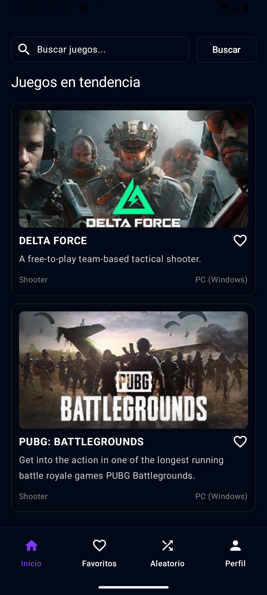
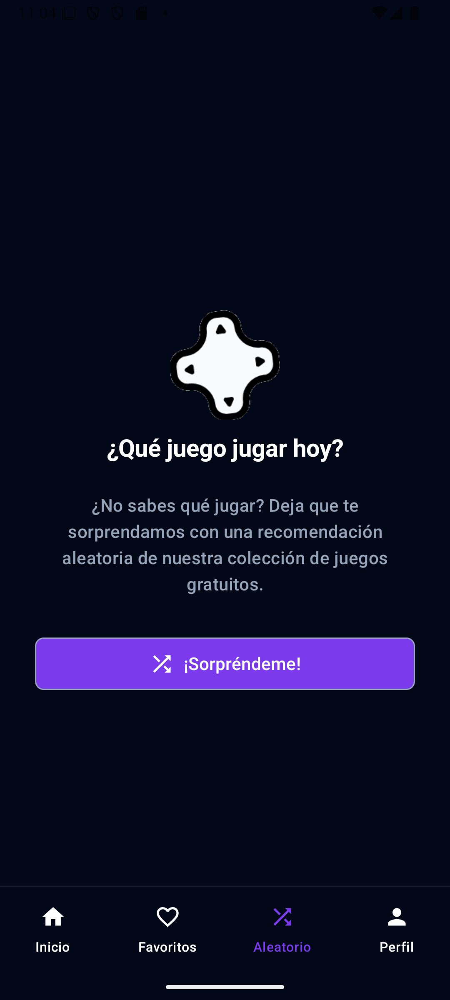
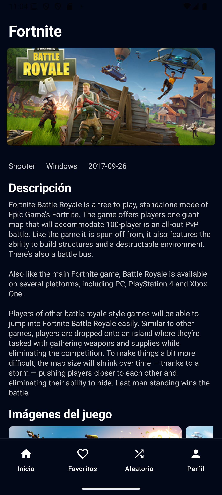
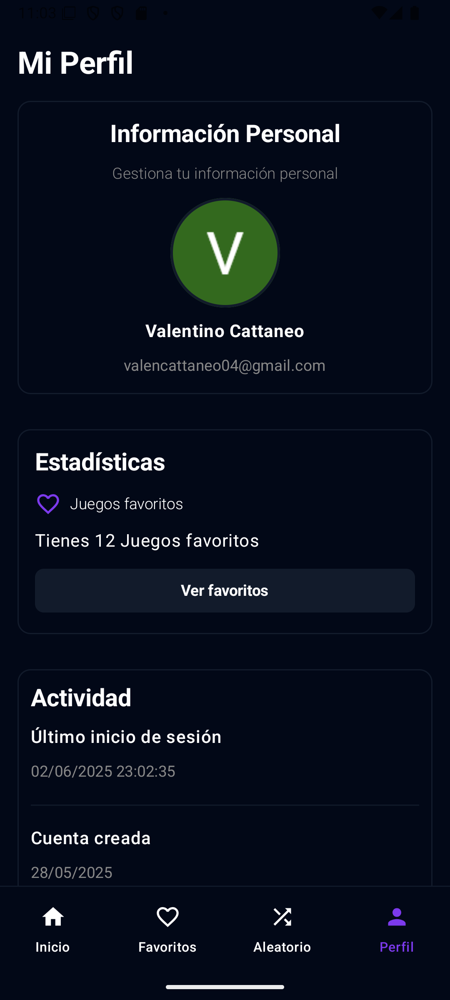

# 🎮 GamesVault - Tu Biblioteca de Videojuegos Móvil  

[](https://kotlinlang.org)
[](https://opensource.org/licenses/MIT)
[](https://android-arsenal.com/api?level=24)

Aplicación Android para descubrir, explorar y guardar tus videojuegos favoritos. Conectada a una API externa para obtener datos actualizados.

<p align="center">
  
</p>

## ✨ Características Principales
- ✅ Búsqueda de juegos por nombre, género o plataforma  
- 🔍 Detalles completos de cada juego (descripción, rating, fecha de lanzamiento)  
- ❤️ Sistema de favoritos con persistencia local  
- 👤 Autenticación de usuarios (registro/login)  
- 📱 Interfaz moderna con Material Design 3  

## 🛠 Tecnologías Utilizadas
| Categoría       | Tecnologías                                                                 |
|-----------------|----------------------------------------------------------------------------|
| **Lenguaje**    | Kotlin                                                                     |
| **Arquitectura**| MVVM (Model-View-ViewModel)                                                |
| **Jetpack**     | ViewModel, LiveData, Navigation Component                                  |
| **Networking**  | Retrofit + Gson                                                            |
| **Persistencia**| SharedPreferences (Room próximamente)                                      |
| **UI**          | Jetpack Compose                                                            |

## 📸 Capturas de Pantalla
<div align="center">
  
  
  
  
</div>

## ⚙️ Configuración
1. Clona el repositorio:
   ```bash
   git clone https://github.com/ValentinoCattaneoLuna/gamesVault.git
